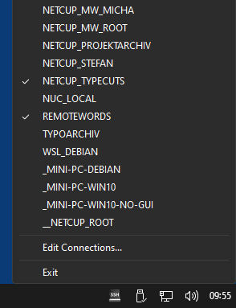
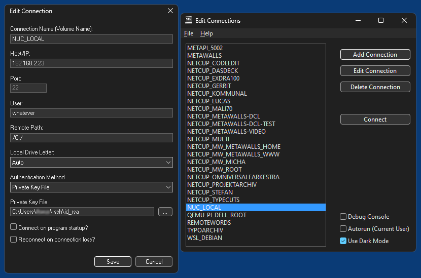

# Win-SSHFS-Mounter

Win-SSHFS-Mounter is a small System Tray application for Windows that allows to mount and unmount [SSHFS](https://github.com/libfuse/sshfs) Drives. It depends on [WinFsp](https://winfsp.dev/). Other than that it has no more dependancies, it does **not** use [sshfs-win](https://github.com/winfsp/sshfs-win), but instead bundled unaltered versions of [Cygwin](https://www.cygwin.com/)'s sshfs, ssh and sshpass.

## Setup and usage

* Install WinFsp.
* Install and run Win-SSHFS-Mounter, or use the portable version without setup.
* Configured SSHFS-connections/drives can be mounted/unmounted directly from the systray icon's popup menu.
* The GUI for adding/editing connections can be opened by double clicking on the systray icon or selecting "Edit Connections..." in the popup menu.
* Connections are stored in the registry (in user space) and erased when you uninstall the app. In case of the portable version you can execute enclosed "remove-settings.reg" to remove the registry key.
* If you choose "Password (saved)" as authentication method, the password stored in the registry is encrypted using a simple XOR encryption, which only prevents to obtain it directly without having the application's source code. Other authentication methods like "Private Key File" are usually a better choice.

## Features

* Import sites from FileZilla (sitemanager.xml, sites.xml) and WinSCP (WinSCP.ini), including saved passwords.

## Screenshots

*Win-SSHFS-Mounter in System Tray (Windows 11)*  

*Win-SSHFS-Mounter GUI (Windows 11)*  

